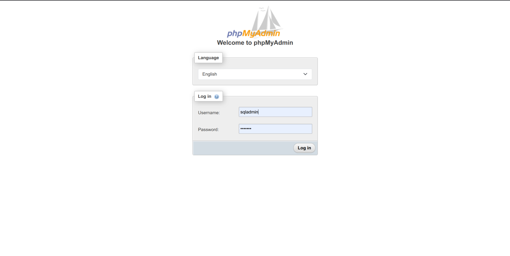
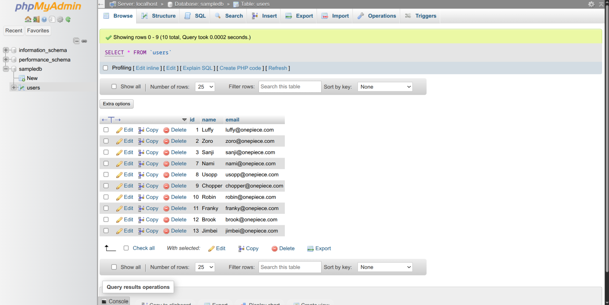

📦 Ansible LAMP Stack Automation

A fully automated LAMP (Linux, Apache, MySQL, PHP) stack deployment using Ansible on CentOS 9 Stream.

🚀 Features

✅ Installs and configures:

Apache (httpd)
MySQL (mariadb)
PHP and required extensions
phpMyAdmin

✅ Creates a sample MySQL database with sample data
✅ Deploys a custom landing page to test database interaction
✅ Uses Ansible best practices with roles and handlers
🗂️ Project Structure

```
ansible-lamp-centos/
├── ansible.cfg
├── collections
│   └── requirements.yml
├── group_vars
│   └── all.yml
├── inventory
│   └── hosts.ini
├── roles
│   ├── apache
│   │   ├── files
│   │   │   └── index.php
│   │   ├── handlers
│   │   │   └── main.yml
│   │   └── tasks
│   │       └── main.yml
│   ├── mysql
│   │   ├── files
│   │   │   └── sample_schema.sql
│   │   └── tasks
│   │       ├── db_setup.yml
│   │       └── main.yml
│   ├── php
│   │   ├── files
│   │   │   └── db_config.php
│   │   ├── handlers
│   │   │   └── main.yml
│   │   └── tasks
│   │       └── main.yml
│   └── phpmyadmin
│       ├── files
│       │   └── phpmyadmin.conf
│       ├── handlers
│       │   └── main.yml
│       └── tasks
│           └── main.yml
└── site.yml
```

🛠️ Installation Requirements


Control Node:

Ansible installed (version 2.9+ recommended)

Access to target CentOS 9 Stream servers via SSH with sufficient privileges (passwordless sudo preferred)

Managed Nodes:

CentOS 9 Stream servers with network connectivity

No pre-installed LAMP stack required; playbook installs all components

Additional:

Python 3 installed on managed nodes (required for Ansible modules)

Firewalld enabled for firewall management


🚀 How to Run


Clone the repository:

git clone https://github.com/yourusername/ansible-lamp-centos.git

cd ansible-lamp-centos

Customize inventory/hosts.ini with your server IP(s).

Modify group_vars/all.yml if you want to adjust package names, PHP version, or other variables.

Run the playbook:

ansible-playbook -i inventory/hosts.ini site.yml


🐞 Troubleshooting Tips


Playbook fails due to missing Python on managed nodes:

Ensure Python 3 is installed on your CentOS 9 servers. You can install it manually or add a bootstrap task before running the full playbook.

Firewall issues blocking Apache or MySQL:

The playbook enables firewalld and opens required ports (80, 3306). Verify firewall status and ports:

sudo firewall-cmd --list-all

MySQL service fails to start:

Check MySQL logs on the managed node:

sudo journalctl -u mysqld

Verify credentials and database setup in roles/mysql/tasks/db_setup.yml.

phpMyAdmin not accessible:

Ensure Apache includes the phpMyAdmin configuration and that no IP restrictions block your access. The playbook deploys the config in /etc/httpd/conf.d/phpmyadmin.conf.

Ansible syntax errors:

Validate your playbook syntax before running:

ansible-playbook --syntax-check -i inventory/hosts.ini site.yml

SSH connection issues:

Verify your control node can SSH into managed nodes without prompts.


🧪 Sample Output Page


The landing page <ip-address> includes a dynamic table that displays user records from the MySQL database.
The phpMyAdmin web interface <ip-address/phpmyadmin> prompts you to log in with the db user (sqladmin,sqlpass), and allows you to manage the sampledb user table.

### ✅ Website index.php output (with MySQL user data)


### ✅ phpMyAdmin login screen



### ✅ Viewing the `users` table inside phpMyAdmin




📚 Skills Demonstrated


Linux System Administration 🐧

Infrastructure as Code (IaC) with Ansible 🛠️

Service hardening and automation

MySQL database creation and seeding

PHP/Apache configuration

Modular role-based Ansible playbooks


## 👤 Author

**Jordan Hall**

Linux System Administrator | RHCSA Certified | RHCE in Progress

🔗 [GitHub](https://github.com/jordanhall-it)

💼 [LinkedIn](https://www.linkedin.com/in/jordanhall-it)

📫 [Email](jordanhall.it@gmail.com)


📜 License

MIT License

